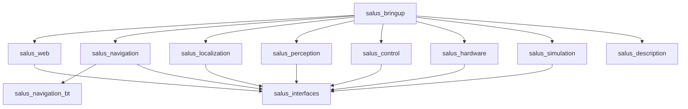

# Arquitectura

Estado: decisión inicial  
Fuente de verdad estructural: `docs/package-map.yaml`

## Principios

- Un paquete, una responsabilidad principal.
- Dependencias dirigidas y sin ciclos.
- Algoritmos independientes del backend real o simulado.
- Composición completa exclusivamente en `salus_bringup`.
- Contratos ROS compartidos exclusivamente en `salus_interfaces`.
- Configuración explícita, versionada y separada por perfil.
- Ningún componente se considera operativo sin tests real/sim y runbook.

## Capas

Las flechas representan composición o dependencia permitida. `salus_bringup`
puede depender de todos los paquetes, pero ningún subsistema puede depender de
`salus_bringup`. Los algoritmos no dependen de `salus_web` ni de
`salus_simulation`.

## Invariantes reservadas

- TF global: `map -> odom -> base_footprint`.
- Control conceptual: `/cmd_vel -> /cmd_vel_safe -> /cmd_vel_final`.
- Un solo publisher por transformación dinámica.
- La misma API lógica debe admitir backends real y simulado.
- HOME, rutas, batería y estados degradados deben ser observables.

Estas invariantes aún no están implementadas.

## Configuración

Cada parámetro operativo deberá documentar tipo, unidad, default, rango y
perfil. Los valores comunes viven con el paquete propietario; los overrides de
composición viven en `salus_bringup/config/<profile>/`. Secretos, dispositivos
locales y datums de sitio no se codifican en los launches.

## Diagnóstico

Cada subsistema deberá exponer estado tipado y diagnóstico suficiente para
distinguir entrada ausente, entrada vencida, configuración inválida y fallo de
backend. Los logs complementan esos contratos, no los reemplazan.

